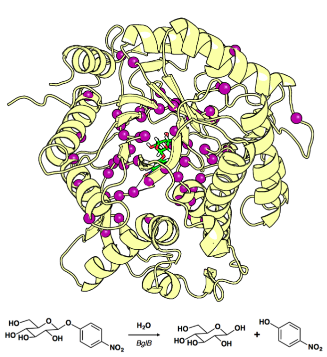
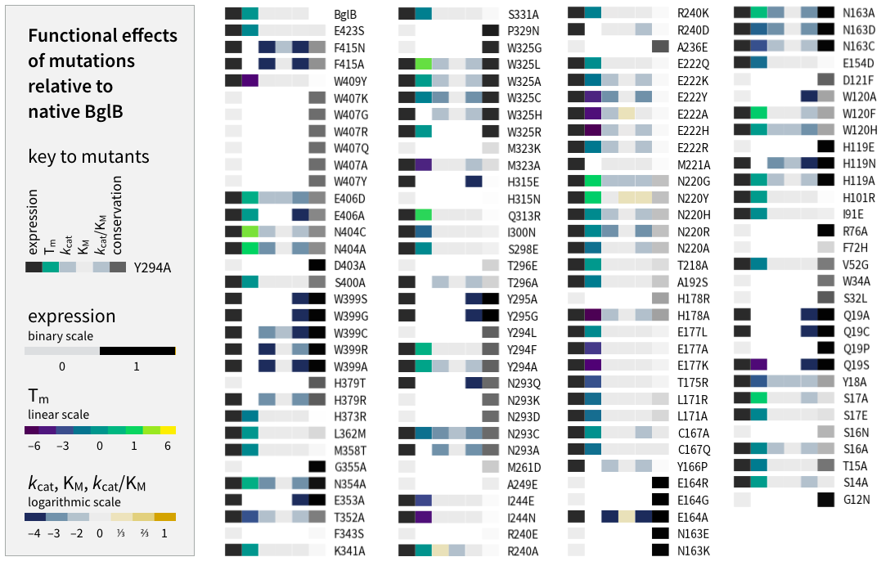
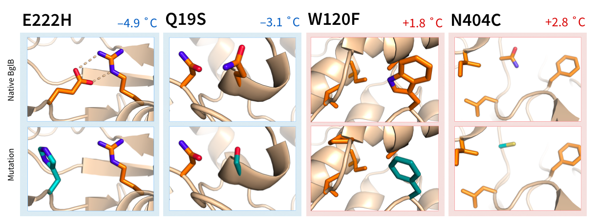
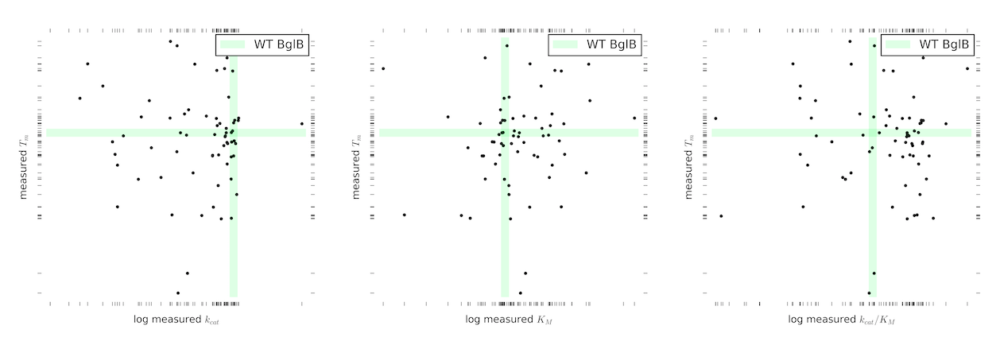

# Experimental measurements of protein expression, thermal stability, and enzyme kinetic constants for 128 mutants of a glycoside hydrolase enable discovery of structural features correlated to protein stability

## Author contributions (alphabetical by last name)

+ Bowen Bethards [1]: designed mutants, characterized mutants
+ Dylan Alexander Carlin [2]: designed mutants, cloning, designed experiments, wrote software used in analysis, analyzed data, modeling, machine learning, wrote paper
+ Ryan Caster [1]: characterized mutants
+ Bill Chan [1]: designed mutants, characterized mutants, analyzed data, contributed to paper
+ Natalie Damrau [1]: designed mutants, characterized mutants
+ Siena Hapig-Ward [1]: designed mutants, characterized mutants, analyzed data, contributed to paper
+ Mary Riley [1]: designed mutants, characterized mutants
+ Justin B. Siegel [1,3,4]: PI, provided lab, materials, designed experiments, paper

## Author affiliations:

1. Genome Center, University of California, Davis CA, USA
2. Biophysics Graduate Group, University of California, Davis CA, USA
3. Department of Chemistry, University of California, Davis CA, USA
4. Department of Biochemistry & Molecular Medicine, University of California, Davis CA, USA

**Subject areas**: biophysics, computational biology, protein engineering

**Keywords**: enzyme, Rosetta, thermal stability, machine learning

---

### Outline

+ Introduction

  + motivation
  + current computational approaches
  + summary of what we did
  + **Figure 1**: all positions selected in study

+ Methods

  + cloning and mutagenesis
  + production and purification
  + assay and data analysis
  + computational modeling and machine learning

+ Results

  + summary of all mutants, wild type values, limits of detection
  + mutants less thermostable, mutants more thermostable
  + **Figure 2**: heatmap with expression, Tm, kcat, km, kcat/km for each mutant
  + **Figure 3**: drawings of discussed mutants W120F, N404C, H178A, E222H
  + **Figure 4**: crystal structure with residues colored per change in Tm compared to wild type
  + Rosetta structural features predict expression, but not Tm
  + **Figure 5**: machine learning model evaluation

+ Discussion

  + summary of what we showed and connections to background
  + implications for biotechnology
  + implications for human health
  + conclusion

+ Supporting information

  1. Table of protein expression, melting temperature, kinetic constants, and statistical analysis for each of 125 mutants (CSV)
  1. Michaelis-Menten plots for each mutant for which kinetic constants are reported (ZIP file containing images)
  1. Plot of protein melting for each mutant for which Tm is reported (ZIP file containing images)
  1. Images of gel band for each protein used in this study (ZIP file or single TIFF image)
  1. Additional information about experimental procedures (text)
  1. Additional information about machine learning (text)
  1. Rosetta and FoldX input files (ZIP containing text files)

---

# Introduction

The importance of enzymes in biotechnology makes the accurate modeling of enzyme thermal stability and soluble expression in heterologous hosts such as *Escherichia coli* an important goal for the protein modeling community. Yet, despite the importance of these goals, the prediction of the stability effect of point mutations in proteins has not been fully achieved, and neither has the predicition of the expression of sequences in heterologous hosts.  

Previous efforts to predict the stability effects of point mutations in proteins have used features derived from force-field–based molecular modeling combined with machine learning algorithms [Masso]. However, previous approaches have faced three primary challenges. Sequence-based approaches have never been good, because sequence space too big and too spare, and 3D structure ignored or inferred from evolutionary data alone. Quantitative approaches based on single metrics have been hampered by data sets that are large but constructed without regard for standardization [ProTherm] so the data points, if even for the same enzyme (rare to have more than a handful), are not quantitatively comparable, reducing the accuracy and usefulness of predictions made by these methods. A further problem is that high-quality data sets that are quantitative and large have already been used to refine protein modeling algorithms and thus in some sense have been seen by the algorithms before [cite]. Thus, the accurate modeling of stability effects of point mutations, while important for next-generation medicine, remains a substantial challenge for protein stability prediction algorithms.

We have previously shown the ability to model changes in enzyme functional parameters kinetic constants kcat, KM, and kcat/KM using machine learning algorithms trained to experimental data with structural features generated from Rosetta modeling. Here, we expand this data set with protein soluble expression, melting temperature, and kinetic constants kcat, KM, and kcat/KM for 128 mutants.

We show that this data set can be used to evaluate the utility of computational features generated by leading protein modeling software (Rosetta and FoldX) in predicting the soluble expression of the 128 mutants in our data set. We then show the use of the experimental data to build a predictive model of soluble enzyme expression and melting temperature. We show that, while models for predicting melting temperature require larger data sets to become feasible, we are able to apply our model to a blind test set of 10 mutants, on which we achieved a predictive accuracy of X percent, representing a significant improvement of force-field based approaches alone.

It is clear that, while computational tools are far advanced, they have outstripped their training data. Thus, large, self-consistent data sets are needed to evaluate current algorithms and develop new, improved methods. Here, we show that a data-driven apparoch provides the tools

**Figure 1: Overview of BglB structure showing positions mutated in this study**: PyMOL rendering of modeled BglB in complex with pNPG (top panel) showing the Cɑ of the 60 sequence positions selected for this study (purple) and the modeled transition-state structure (green). Reaction scheme of the hydrolysis of pNPG by BglB (bottom panel).

# Methods

## Mutant selection by molecular modeling in Foldit

The crystal structure of recombinant BglB in complex with the substrate analog 2-deoxy-2-fluoro-α-D-glucopyranose was used to identify the substrate binding pocket and the catalytic residues, and a macromolecular model of BglB was created using Rosetta. Functional constraints were used to define catalytic distances, angles, and dihedrals among 4-nitrophenyl-β-D-glucoside, E164, E353, and Y295. The structure was then loaded into Foldit, a graphical user interface to Rosetta. Point mutations to the protein were modeled, and a subset were chosen by students learning about molecular modeling. Generally, the designs had energies no more than 5 Rosetta energy units higher than the native structure, but no other design constraints were used to select mutations.

## Molecular cloning and mutagenesis

A gene coding for BglB was codon-optimized for *Escherichia coli* and synthesized as linear dsDNA (Life Technologies). The construct was cloned into a pET29b+ vector linearized with XhoI and NdeI (NEB) using Gibson assembly master mix (NEB) and verified by Sanger sequencing (Operon). Kunkel mutagenesis was used to generate designed variants of BglB via an automated cloud laboratory (Transcriptic), which were then verified by Sanger sequencing (Operon, GenScript).

## Protein production and purification

Sequence-verified constructs were transformed into chemically competent *Escherichia coli* BLR. Single colonies were used to inoculate 5 mL Terrific Broth (TB) (Fisher) in 50 mL Falcon tubes (Fisher) with breathable seals (Fisher). After incubation at 37 C with shaking at 300 RPM for 24 hours, cells were pelleted and media replaced with 5 mL TB containing 1 mM isopropyl β-D-1-thiogalactopyranoside (IPTG). After incubation at 18 C with shaking at 300 RPM for 24 hours, cells were pelleted, resuspended in enzyme storage buffer (50 mM HEPES, 150 mM sodium chloride, 25 mM EDTA, pH 7.50) and lysed with BugBuster protein extraction reagent (Novogen).

His-tagged BglB proteins were purified via immobilized metal ion affinity chromatography using 50 µL bed volume of Ni-NTA resin (Thermo) and eluted in 300 µL enzyme storage buffer (wash buffer was the same as enzyme storage buffer except omitting EDTA). Protein expression was assessed using 4-12% gradient SDS-PAGE (Life Technologies).

## Enzyme assays and data analysis

For thermal stability assays, triplicate aliquots of freshly-purified proteins in enzyme storage buffer at concentrations ranging from 0.01 to 0.1 mg/mL were incubated at 8 temperatures in 2.5 C increments between 30 C and 50 C in a thermal cycler (BioRad). After 30 minutes, proteins were transferred to assay plates containing 100 mM pNPG in enzyme storage buffer. The rate of pNP production was monitored over 60 minutes and a linear fit to the data was determined by Gen5 software.

For each BglB variant, triplicate rates at 8 temperatures were normalized to the [0,1] interval and fit to the logistic equation `1/(1+exp(-k*(x-x0)))` using least squares (accessed via SciPy's `curve_fit`) to determine the parameters Tm (midpoint) and k (kurtosis).

Michaelis-Menten parameters for each mutant were determined as described previously [Carlin]. Mutants for whom Michaelis-Menten parameters were previously reported use values from the publication.

## Computational modeling and feature generation using Rosetta and FoldX

Three separate approaches to modeling the 128 mutants were taken in this study. In the first, 100 molecular models of each mutant enzyme were generated using the Rosetta Molecular Modeling Suite by Monte Carlo optimization of total system energy using enzyme design protocols as reported in our previous work [Carlin]. The lowest 10 of total system energy were selected for feature generation and a total of 50 features were calculated for each protein model.

In a second approach, mutants were generated and scored using benchmarked [Kellogg] Rosetta ddG application, which generates 50 models and averages the best 3 models to provide a feature set of 13 features.

In a third approach, models were generated and scored using FoldX PSSM application, which generates a feature set of 13 features per model. The lowest energy model was selected for feature generation.

## Machine learning

### Binary classification of soluble expression

Two classifers were chosen for their predicitons on the feature set. The first, an implemnetation of SVM from scikit-learn, performance was asssed via grdi search across kernals (linear, ploy, and RBF) taking care to balance the uneven class eights, and performance was evaluated precision, recall, and ROC. The predicitons for the SVM perfmance awas X and Y by these measures.

THe second classifer was a RandomForest, was also trained on the same input data, and achieved accuracies of X. However, accury may not be the best metric for an ubabalance d dbata dset asucha s the one presneted here. Therefore, alternate appraoches to assigning classes were used.

In the first apparoch, a two-class prediciton of detrimental versus beneficial was assess by assigning those proteins with a Tm graether than 1 C above WT to the positive class, and the proteins with a TM belowe 1 C less than wild type and those that did not express to the nagative class.

IN the second approach, a three-class labeles were used to separate proteins into benedicial (Tm > 1 C above WT), neutral (-1 < Tm < 1), or detrimental (no express, or Tm < -1). IN this data set, XX proteins were used (not all 128)

In the final approach, proteins were classed by whether we were able to determine tht Tm or not (a much easier problem, somewhat like convoluting all the parameters together). Since the limit of detection of the thermal stability assay is XXX, then protnes above this threshhold are represnted. It may be the case that this is the bilocalglly relevant class distribution (note class dributiaon across out data set is relativly even). ALl 128 mutants proteins were in this data set.

### Regression problem: predicting subtle effects on Tm

For predicitng Tm continous variable, three featre sets were used: FOldX, RosettaDesign, and and RosettaMonomer. 62 Tm sampels were used.

# Results

A total of 128 proteins, not including batched replicates of wild type BglB produced with each batch, were produced, purified, and characterized in this study. Of 128 proteins synthesized and assayed, 86 (67%) express and purify as soluble protein. The remaining 42 mutants did not appear on a gel after at least 2 independent production attempts.

Of the 86 solubly-expressed mutants, melting temperature for 62 was determined by fitting rate data collected at 8 temperatures from 30 to 50 C to the logistic equation. For the the remaining 24 mutants that expressed as soluble protein,  could not be used to determine Tm because the kinetic constants for these mutants are below our limit of detection.

The wild type BglB 8 replicates had an average melting temperature of 39.6 C across assay data from 8 biological replicates. In the data set reported here, representing Tm for 62 mutants, the average melting temperature was 39.0±1.7 C, with a range of 32.9 C to 45.3 C. Of 62 mutants for which Tm was determined, Tm for 37 of them falls within 1 degree C of the wild type Tm (58%). Of the remaining 49 Tm values, 18 exhibited a lower melting temperature than that of native BglB and 7 displayed a higher melting temperature. The hottest Tm observed in this data set is N404C, which increased the Tm of BglB to 45.3 C (dTm=+5.4 ˚C). The mutation that decreased the thermal stability of BglB the most was H178A (dTm=-7.0 ˚C).

In addition to expression and thermal stability data, we also report kinetic constants for 12 mutants whose kinetic constants had not previously been determined \cite{26815142}. Together, data for soluble expression, kinetic constants (kcat, km, kcat/km), and melting temperature are reported for 128 mutants of BglB (Supporting Information). **Figure 2** depicts the data set as a heat map, with values relative to native BglB.

**Figure 2: heatmap depiction of the entire dataset**. Depiction of expression, Tm, KM, kcat, kcat/KM and conservation for each of the 128 mutants used in this study. For Tm, red boxes indicate a higher Tm, and blue boxes indicate a lower Tm (see legend). For expression, a black box indicates soluble expression, and a white box indicates no expression for this mutant. For kcat, KM, and kcat/km, a diverging colormap is used, with purple values indicating lower values, and green indicating higher values, as indicated by the color legend.

## Sequence-stability relationships in BglB

A novel finding was a nearly six degree increase in melting temperature by single point mutant N404C. The BglB crystal structure reveals a weak hydrogen bond between N404 and the backbone at L402. Molecular modeling of N404C predicts the loss of this hydrogen bond to the protein's alpha helix, in which the protein is allowed to repack into more energetically favorable states.

Similarly, the point mutation W120F resulted in a delta Tm of +1.6 C. The BglB crystal structure indicates a weak hydrogen bond between W120 and the backbone of N163, which could be construed as an unsatisfied polar interaction. The mutation to Phe maintains the structural integrity at the mutation site as well as removes the unsatisfied hydrogen bond donor to the neighboring alpha helix. The increased stability is then due to destabilization of the unfolded state, which exposes a hydrophobic Phe to bulk solvent. It is also worth noting that the mutant W120A results in no soluble protein production after 3 independent attempts, indicating that W120 plays a key role in stabilizing the protein. Previous studies have shown a similar increase in stability upon W to Y point mutations \cite{12600203}. Analysis of a multiple sequence alignment of 5,000 proteins from the Pfam database reveals approximately equal probablity of finding Trp, Phe, or Tyr here, and less than 1% representation of all of the other amino acids combined. Thus, the experimental measurements and the evolutionary record agree that W120 plays a key role in stabilizing BglB. No major structural changes are predicted via Rosetta modeling.  

Additionally, we have additional information about R240. The mutation R240E, which plates a glutamate near the existing glumatate at E222 that forms two hydrogen bonds to R240. The substittuion R240E, which plates two negativly-charged residues in close proximity, results in no soluble protein under our experimental conditions after at least 2 repeated attempts to produce and purify the protein (one of many mutants done this way), providing evidence for the belief that the mutation R240E is destabilizing. Whereas Rosetta modeling predicts no change in deltaG (within 1 REU) for this mutation, and example of a mutation that would have been missed using Rosetta to scan for mutations. However, FoldX assigns a ddG of 3.78, (compare to its score for R240A, which is 1.71) highlighting the importance of a diverse set of estimates chosen by machine learning on experimental data to train algorithms. Mutation R240D, which places a carboxylate only 1.54 A further away, results in a soluble protein.

Point mutation E222H had a melting temperature of 34.7 C, a nearly five degree decrease than that of native BglB. Previous studies show strong hydrogen bond interaction, 2.6 and 3.1 Å, between E222 and its neighboring R240 residue [cite]. The introduction of histidine at the mutation site causes the loss of these strong hydrogen bonds as well as the creation of electrostatic repulsion between the partially positively charged and positively charged amino acids. The cumulative effect of this mutation results in the protein's decreased stability at lower temperatures.

Mutants that did not express followed rules broadly consistant with previous work and sequence conservation, such as the large destabilizing effect of any substitation W407X and XXX. Other mutants that did not express mostly followed well-established observations of destabilizing effects, such as the introduction of proline into an alpha helix (Y166P, Q19P), the mutation of topology-defining/helix-ending proline residues (P329N), mutations to and from glycine (), the introduction of charged residues into the hydrophobic core (A236E, F72H), and extreme small-to-large mutations (A227W).

It is interesting to note that all the mutations we made in our study to the catalyic nucelophile (E353) and acid-base (E164) polar residues resulted in soluble protein, consistent with the idea that enzymes must trade structural stability for function in placing these two negatively-charged groups less than 5 Å apart (the sole exception, E164G, could be the result of an altered folding trajectory due to the conformational freedom of glycine). Notable is that all the catalytic knockouts, E164A, E164R, E353A, Y295A, Y295G, except for E164G, where a glycine is intersted in an alpha helix, result in protein that is solubly expressed in our system, supporting the belief that these mutations are beneficial to protein stability as detremental as they are to enzyme function.

**Figure 3: Single point mutants with extreme effects on thermal stability**:  Four mutant panels are shown, sorted from left to right by delta-Tm. For each mutant, PyMOL images depict the local area of the mutation in the BglB WT protein (top) and Rosetta model of mutatation (bottom). In the bottom most panel, the assay for the mutant (black dots) is shown along with the fitted Tm (black dashed line) and the melting curve for WT BglB (green) as measured over 8 replicates in this study (the Y axis is in arbitrary units and the X axis covers the range 30-50 C).

## Generation of Rosetta structural features from molecular models and machine learning

The Rosetta Molecular Modeling suite was used (code in Supplemental) to generate 100 molecular models of each mutant protein. The lowest 10 models based on total system energy score were used to calculate a set of 50 structural features, and these features were averaged across the lowest 10 models to give a set of 50 features per mutant. The 50 features were normalized to mean of 0 and variance of 1 prior to being used as training data.

Protein expression based on SDS-PAGE was assessed (2 biological replicates per protein sample) and a 0 was assigned to proteins that did not express solubly, and a 1 was assigned to expressed proteins. A classifier based on support vector machines (SVM classifier) was trained on the features for the mutants with experimental data (scikit-learn). We used 10-fold cross validation repeated 1000 times with the results averaged over the 1000 trials. Figure 4 shows the receiver operating characteristic (ROC) curve for the cross-validated predictions.

# Discussion

The key role of enzymes in performing specific chemical transformations under conditions dictated by the process environment in biotechnology makes the effective modulation of enzyme functional envelope of great importance in biotechnology. On the other side of the functional spectrum, many human diseases are caused by single point mutations to enzymes that result in nonfunctional proteins. In this case, it would be of great benefit to use cheap, fast, and plentiful genomic information to predict the functional effects of SNPs. Together, the importance of enzymes in biotechnology and human disease make the accurate modeling of enzyme stability an important goal of the protein modeling community. Accurate prediction of a point mutation's effect on enzyme stability would unlock rational protein engineering approaches, where the information could be used immediately to rationally engineer an enzyme's functional envelope for a desired situation as has been previously explored \cite{22575958}. Furthermore, understanding the changes in enzyme stability that occur upon point mutations would provide huge insight into understanding inherited diseases of metabolism [cite], cancer [cite], as well as mechanisms by which bacteria become resistant to antibiotics, which is lately a public health menace [cite].

We have previously reported on a data set containing of data on expression, Michaelis-Menten constants kcat, KM, and kcat/KM for 100 mutants of a glycoside hydrolase, BglB from P. polymxa. Using a constrained statistical learning technique (elastic net), we evaluated 50 structural features derivied from modeling using RosettaDesign [cite]. Building on our previous work, we have experimentally determined kinetic constants for a further 28 mutants, as well as soluble protein expression and thermal stability for the original 100 mutants, for a total of 128 mutants with protein expression, thermal stability, and kinetic constants. We hypothesized that a subset of features from RosettaDesign could be used to predict thermal stability and protein soluble expression.

Previous attempts to predict stability changes in proteins conferred by point mutations have not considered enzymes specifically \cite{18632749}, and have suffered by decades-old low-throughput molecular biology and biochemistry techniques. Thus, the largest data sets for which melting temperature $Tm$ is explicitly measured have been around 30 mutants [cite]. Other studies have collected large amounts of data, but it suffers from convolution of separate/othoganal [we will show that kcat and tm are not correlated] parameters/fuzzy measuremetns [cite: Romero and others]. Large data sets of thermal stabilities also exist, yet the data sets collected there were created without regard for standardization for varying experimental conditions \cite{14681373} and so suffer from a lack of comparability between measurements. Another notable limitation of computational efforts to predict the stability effects of mutations is that most have algorithms are trained on mutational data collected from multiple proteins of diverse origin [http://journals.plos.org/ploscompbiol/article?id=10.1371%2Fjournal.pcbi.1003592]. The result is that existing data sets either contain specific measurements for a small number of enzymes, or fuzzy measurements of large numbers of variants. This is likely due to the immense cost of generating and characterizing large numbers of variants under standardized conditions.

Since to the challenges faced in experimentally characterizing large numbers of mutants, which often carries significant financial cost, are so great, computational approaches to predict the stability of enzyme mutations have in turn relied on these far from ideal data sets as training data. Previous work to develop predicitive models of enzyme function using a combination of machine-learning and compuatoional modeling have relied in protein-protein-interaction data for large number of individual proteins, with a small number of mutations each [http://journals.plos.org/ploscompbiol/article?id=10.1371%2Fjournal.pcbi.1003592]. Or relied on ProTherm, a database that seeks to collect data on enzyme mutations. ProTherm has the additional problem that no attempt at standardization has been made, and as a result the experimental values are on different scales for each mutation and certainly for each protein. Previous attempts to predict the effect of point mutations on antibodies (~100 residues) have used primary sequence and amino acid properties as features \cite{21710487}.

No study, that I can find, has combined both a standardized approach to experimental characterization, and produced enough mutants to allow a sufficiently large training set to evaluate predictive ability.

## Proposed approach to predicting the stability of point mutants of a family 1 glycoside hydrolase

We have previously shown the ability to select informative features from a set generated by Rosetta for the prediction of kinetic constants \cite{26815142} using structural features calculated from molecular models of BglB, a family 1 glycoside hydrolase. We hypothesized that a subset of Rosetta's feature set could be used to predict protein soluble expression as well as change in thermal stability conferred by point mutations to the BglB structure.

Here, we present protein soluble expression and thermal stability data for 128 single point mutants of BglB. In order to construct this data set, we relied on students learning about molecular modeling to design mutations predicted to be compatible with a model of the enzyme-substrate complex. High-thoughput robotic automation was used to perform the molecular cloning, and open-source lab protocols, released on GitHub, were used to experimentally characterize 128 enzyme mutants. The experimental measurements were combined with structural features calculated from full-atom moelcular models of the enzyme-substrate complex by Rosetta and FoldX. Machine learning regression and classification was performed to evaluate the correlation between predicitons and experimental data for X classes of problem, including predicitng the continuous variable Tm, the binary class expressed/not expressed, and the ternary unbalanced classes (detrimental, neutral, and beneficial).

## Summary of our findings

Here, we report the thermal stability and soluble protein expression for 120 mutants of BglB. This data set was enabled by the use of high-throughout roboticly automated molecular biology tools for site-directed mutagenesis as well as open-sourced laboratory protocols carried out my relatively inexperienced student researchers. We described the use of this data set to train machine learning algorithms to develop a classifier that was able to predict the soluble protein expression with an accuracy of X, and the thermal melting temperature with a PCC of X.

Traditonally, [cite] studies of this type have sought to design more thermostable mutants. However, we are interested more in less thermostable mutants in the context of human disease. Since it is accepted that a number of human diseases are caused by defects in particular enzymes of metabolism, It would be interesting to investigate whether the opposite is true: whether mutations that increase turnover number or decrease dissociation constants also result in diseases. Perhaps diseases of excess are as common as diseases where a defective enzyme is to blame.

In any case, our previous work sampled functional space in a way that captured almost entirely constants of lower magnitude than the natural sequence chosen as our baseline (it cannot be helped to think that if we had instead begun with a mutant of approximately half the kcat of the WT, we should have been able to see many mutations that increase the kcat). However, in the set of protein melting temperatures reported here, 25 mutants have a Tm that is greater than WT (39.6 C), while 32 have a Tm that is lower (0.78:1 ratio).

**Figure 4: statistical independence of protein melting temperature (Tm) and kinetic constants.** Plots of Tm versus kinetic constant for each of kcat, KM, and kcat/km. Tm values are on a linear scale (C) and kinetic constant values are on a log scale.

It is interesting to note that the protein melting temperatures and kinetic constants reported in this study were not found to be correlated. This sheds doubt on studies [Romero] that convolute these parameters into specific activity measurements, for one can never be sure the functional parameter that is tuned to result in an inactive mutant. In biotechnology, however, this finding is a boon: it means that kinetics and thermal stability, and perhaps other parameters of the functional envelope, arise from independent (if overlapping) biophysical properties, and thus can be rationally modulated independently. This neatly avoids the "two-objective optimisation problem" assumed to exist by engineers seeing to maximize two parameters (such as kcat and thermal stability) independently [http://pubs.rsc.org/en/content/articlepdf/2015/cs/c4cs00351a]. Whether this finding is relevant to BglB alone is unclear, as other studies have shown a strict linear correlation between delta-G and kcat/km for RNase [http://www.ncbi.nlm.nih.gov/pmc/articles/PMC1219248/].

We are happy to see our method predict destabilizaing mutations with overt effects of protein structural stability (P325, G12P, etc.), but we are even happier to see subtle effects recapitulated in our predictions [example?]. As reported previously, we note that prediction error increases as the number of samples in a particular bin or class decreases, and thus we seek ways to more evenly sample functional space.

One major advantage of large, self-consistent data sets such as the one presented here is that they do not exist in existing databases and thus provide unbiased results (from the point of view that they are not already in the training set, as would happen if FoldX was refined without publishing). As published data sets are used to refine existing software, that software accumulates a bias toward overfitting that is recapitulatted whenever a new group seeks to evaluate the predicitive ability of the software on old data sets. Therefore, it is of crucial importance to generate large, self-consistent data sets such as the one predicnted here to accuracly evaluate predicitive modeling algorithms.

## Implications of our findings to biotechnology

In biotechnology applications, it is enough to generate hypotheses with a distrubution around the correct mutaion, as long as these mutations are accurate enough so that they are better than random. - in biotechnology, it is OK to have mild predictive power, as large numbers of mutations are tried. Still, the best we can do is better than current approaches X, Y, and Z. Describe how what we did is better.

## Implications of our findings to human health

In the prediction of disease state from genomic sequcne, of relevance to human health, it is advisable to have the fewest number of false positives, which create unnecessary  cost and scare patients, as well as low false negatives, which result in important diagnose to be missed. Unfortunately, our current approach falls short, but we propose that this approch could be expanded in the future for more accurate predictions, through larger data sets. And improved predictive modeling.

---

BibTex biblio:

@article{21710487,
  title = {{High-throughput measurement, correlation analysis, and machine-learning predictions for pH and thermal stabilities of Pfizer-generated antibodies.}},
  date = {2011 Sep},
  source = {Protein Sci},
  authors = {King, AC and Woods, M and Liu, W and Lu, Z and Gill, D and Krebs, MR},
  author = {King, AC and Woods, M and Liu, W and Lu, Z and Gill, D and Krebs, MR},
  year = {2011},
  month = {Sep},
  journal = {Protein Sci},
  volume = {20},
  number = {},
  pages = {1546-57},
  pubmed_id = {21710487},
}

@article{18632749,
  title = {{Accurate prediction of stability changes in protein mutants by combining machine learning with structure based computational mutagenesis.}},
  date = {2008 Sep 15},
  source = {Bioinformatics},
  authors = {Masso, M and Vaisman, II},
  author = {Masso, M and Vaisman, II},
  year = {2008},
  month = {Sep},
  journal = {Bioinformatics},
  volume = {24},
  number = {},
  pages = {2002-9},
  pubmed_id = {18632749},
}

@article{14681373,
  title = {{ProTherm, version 4.0: thermodynamic database for proteins and mutants.}},
  date = {2004 Jan 1},
  source = {Nucleic Acids Res},
  authors = {Bava, KA and Gromiha, MM and Uedaira, H and Kitajima, K and Sarai, A},
  author = {Bava, KA and Gromiha, MM and Uedaira, H and Kitajima, K and Sarai, A},
  year = {2004},
  month = {Jan},
  journal = {Nucleic Acids Res},
  volume = {32},
  number = {},
  pages = {D120-1},
  pubmed_id = {14681373},
}

@article{26815142,
  title = {{Kinetic Characterization of 100 Glycoside Hydrolase Mutants Enables the Discovery of Structural Features Correlated with Kinetic Constants.}},
  date = {2016},
  source = {PLoS One},
  authors = {Carlin, DA and Caster, RW and Wang, X and Betzenderfer, SA and Chen, CX and Duong, VM and Ryklansky, CV and Alpekin, A and Beaumont, N and Kapoor, H and Kim, N and Mohabbot, H and Pang, B and Teel, R and Whithaus, L and Tagkopoulos, I and Siegel, JB},
  author = {Carlin, DA and Caster, RW and Wang, X and Betzenderfer, SA and Chen, CX and Duong, VM and Ryklansky, CV and Alpekin, A and Beaumont, N and Kapoor, H and Kim, N and Mohabbot, H and Pang, B and Teel, R and Whithaus, L and Tagkopoulos, I and Siegel, JB},
  year = {2016},
  month = {},
  journal = {PLoS One},
  volume = {11},
  number = {},
  pages = {e0147596},
  pubmed_id = {26815142},
}

@article{22575958,
  title = {{Engineering the third wave of biocatalysis.}},
  date = {2012 May 9},
  source = {Nature},
  authors = {Bornscheuer, UT and Huisman, GW and Kazlauskas, RJ and Lutz, S and Moore, JC and Robins, K},
  author = {Bornscheuer, UT and Huisman, GW and Kazlauskas, RJ and Lutz, S and Moore, JC and Robins, K},
  year = {2012},
  month = {May},
  journal = {Nature},
  volume = {485},
  number = {},
  pages = {185-94},
  pubmed_id = {22575958},
}

@article{12600203,
  title = {{Energetic and structural analysis of the role of tryptophan 59 in FKBP12.}},
  date = {2003 Mar 4},
  source = {Biochemistry},
  authors = {Fulton, KF and Jackson, SE and Buckle, AM},
  author = {Fulton, KF and Jackson, SE and Buckle, AM},
  year = {2003},
  month = {Mar},
  journal = {Biochemistry},
  volume = {42},
  number = {},
  pages = {2364-72},
  pubmed_id = {12600203},
}
